  

# BookMyTable - PP4

  

**BookMyTable** is a web application designed to streamline the restaurant reservation process and menu management. This project, developed by [Florin Pinta (xttrust)](https://github.com/xttrust), serves as a comprehensive solution for both diners and restaurant staff, offering an intuitive platform to handle reservations and menu items efficiently.

  

Explore the live application at [BookMyTable Deployed Site](https://bookmytable-8de20a7bca65.herokuapp.com/).

  

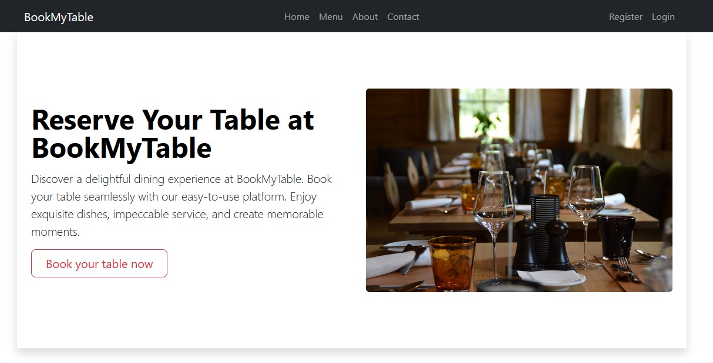

  

## User Experience

  

### User Stories

  

#### New User

  

1. As a user, I can **register for an account** so that I can make and manage reservations. [#6](https://github.com/xttrust/BookMyTable/issues/6)

2. As a user, I can **log into my account** so that I can access my reservations and profile. [#7](https://github.com/xttrust/BookMyTable/issues/7)

3. As a user, I can **view available tables for a specific date and time** so that I can choose a suitable table for my reservation. [#9](https://github.com/xttrust/BookMyTable/issues/9)

4. As a user, I can **book a table** so that I can dine at the restaurant. [#11](https://github.com/xttrust/BookMyTable/issues/11)

5. As a user, I can **view my upcoming reservations** so that I can manage my bookings. [#12](https://github.com/xttrust/BookMyTable/issues/12)

6. As a user, I can **see a booking confirmation on the website** so that I have proof of my reservation. [#17](https://github.com/xttrust/BookMyTable/issues/17)

  

#### Existing User

  

1. As an existing user, I can **view and manage my reservations** so that I can keep track of my dining plans. [#12](https://github.com/xttrust/BookMyTable/issues/12)

  

#### Admin

  

1. As an admin, I can **view and manage all bookings** so that I can ensure smooth operations and resolve any issues promptly. [#14](https://github.com/xttrust/BookMyTable/issues/14)

2. As an admin, I can **manage menu items** so that I can update and maintain the restaurant’s offerings. [#23](https://github.com/xttrust/BookMyTable/issues/23)

3. As an admin, I can **manage menu categories** so that I can organize the restaurant’s menu effectively. [#22](https://github.com/xttrust/BookMyTable/issues/22)

5. As an admin, I can **display formatted descriptions in the admin list view** so that information is presented clearly. [#24](https://github.com/xttrust/BookMyTable/issues/24)

  

#### Testing and Documentation

  

1. As a developer, I can **write tests** to ensure the application functions as expected. [#20](https://github.com/xttrust/BookMyTable/issues/20)

2. As a developer, I can **write documentation** so that users and developers understand how to use and contribute to the project. [#21](https://github.com/xttrust/BookMyTable/issues/21)

  

### Site Goals

  

1.  **Simplify the Restaurant Reservation Process**: Provide an intuitive and efficient platform for users to book and manage restaurant reservations effortlessly.

2.  **Enhance Dining Experience**: Offer users the ability to view detailed information about available tables, including real-time availability, to ensure a seamless dining experience.

3.  **Streamline Menu Management**: Allow restaurant staff to easily update and manage menu items and categories, ensuring that diners have access to the latest offerings.

4.  **Facilitate User Account Management**: Enable users to create, access, and manage their accounts, reservations, and preferences securely and conveniently.

5.  **Improve Administrative Efficiency**: Equip restaurant administrators with robust tools to oversee reservations, manage menu items, and handle customer interactions efficiently.

6.  **Ensure Scalability and Performance**: Develop a scalable platform that can handle varying levels of traffic and user activity without compromising performance.

  

## Scope

  

The **BookMyTable** application aims to provide a streamlined and efficient platform for restaurant reservations and menu management. The scope of the project includes:

  

1.  **User Account Management**: Enabling users to register, log in, and manage their profiles.

2.  **Table Reservation System**: Allowing users to view available tables, make reservations, and manage their bookings.

3.  **Menu Management**: Facilitating restaurant staff in managing menu items and categories.

4.  **Administrative Features**: Offering tools for administrators to oversee reservations, manage users, and maintain restaurant details.

5.  **System Notifications**: Providing clear notifications for user actions such as login, logout, registration, table reservations, and updates to ensure a smooth user experience.

6.  **Testing and Documentation**: Ensuring comprehensive testing and providing clear documentation for developers and users.

  

## Epics

  

Epic 1: User Account Management

  

-  **User Registration**: As a user, I want to register for an account to manage reservations. [#6](https://github.com/xttrust/BookMyTable/issues/6)

-  **User Login**: As a user, I want to log into my account to access my reservations. [#7](https://github.com/xttrust/BookMyTable/issues/7)

  

  

Epic 2: Table Reservation

  

-  **View Available Tables**: As a user, I want to view available tables for a specific date and time. [#9](https://github.com/xttrust/BookMyTable/issues/9)

-  **Make a Reservation**: As a user, I want to book a table for dining. [#11](https://github.com/xttrust/BookMyTable/issues/11)

-  **View My Reservations**: As a user, I want to view and manage my upcoming reservations. [#12](https://github.com/xttrust/BookMyTable/issues/12)

  

  

Epic 3: Admin Management

  

-  **Manage Reservations**: As an admin, I want to view and manage all bookings. [#14](https://github.com/xttrust/BookMyTable/issues/14)

-  **Manage Menu Items**: As an admin, I want to manage menu items. [#23](https://github.com/xttrust/BookMyTable/issues/23)

-  **Manage Menu Categories**: As an admin, I want to manage menu categories. [#22](https://github.com/xttrust/BookMyTable/issues/22)

-  **Display Formatted Descriptions in Admin List View**: As an admin, I want formatted descriptions in the admin list view. [#24](https://github.com/xttrust/BookMyTable/issues/24)

  

  

Epic 4: System Notifications

  

-  **Login Notification**: As a user, I want to receive a notification upon successful login.

-  **Logout Notification**: As a user, I want to receive a notification upon successful logout.

-  **Registration Notification**: As a user, I want to receive a notification upon successful registration.

-  **Reservation Notification**: As a user, I want to receive a notification upon successful table reservation.

-  **Update Reservation Notification**: As a user, I want to receive a notification when a reservation is updated.

-  **Delete Reservation Notification**: As a user, I want to receive a notification when a reservation is deleted.

  

  

Epic 5: Testing and Documentation

  

-  **Write Tests**: As a developer, I want to write tests to ensure the application functions correctly. [#20](https://github.com/xttrust/BookMyTable/issues/20)

-  **Write Documentation**: As a developer, I want to write documentation to help users and future developers. [#21](https://github.com/xttrust/BookMyTable/issues/21)

  

  
  
  

## Design

  

### Goal

  

The design of **BookMyTable** aims to provide a clean, modern, and user-friendly interface that enhances the user experience for both diners and restaurant staff. By utilizing the default Bootstrap 5 theme, we ensure a responsive and consistent look across different devices and screen sizes. This choice simplifies the design process while maintaining a professional appearance.

  

### Colour Scheme

  

The default Bootstrap 5 color scheme has been selected for **BookMyTable**. These colors are carefully chosen to provide a balanced and visually appealing aesthetic that suits a wide range of applications. The Bootstrap 5 palette ensures excellent readability and accessibility, which is essential for a diverse user base. The familiar and neutral tones help create a welcoming and easy-to-navigate environment for users. You can view the default Bootstrap colors [here](https://getbootstrap.com/docs/5.0/customize/color/).

## Models

### User Model

The User model is a fundamental component of Django's authentication system, providing essential fields for user management such as username, email, and password. It facilitates user authentication and authorization, serving as the backbone for user interactions within the application. The default User model is extended via the admin interface to include additional functionalities specific to the application's needs.

### Reservation Model

The Reservation model manages the booking details for tables within the restaurant. It includes fields such as the user who made the reservation, the date and time of the reservation, the number of guests. This model is crucial for handling the core functionality of table reservations, ensuring smooth booking and management processes.

### MenuItem Model

The MenuItem model represents individual dishes or drinks available at the restaurant. It includes fields for the item name, description, price, and category (e.g., appetizer, main course, dessert). This model allows for efficient management and updating of the restaurant's menu offerings, ensuring diners have access to the latest menu items.

### MenuCategory Model

The MenuCategory model organizes menu items into categories, making it easier for users to browse through the restaurant's offerings. It includes fields for the category name and a description. This hierarchical structure enhances the user experience by providing a clear and organized menu layout.

### Notification Model

The Notification model manages system notifications for various user actions such as login, logout, registration, and reservation updates. It includes fields for the notification type, message content, and the user to whom the notification is sent. This model ensures users are kept informed of important events and actions related to their account and reservations.

### Database Diagram  
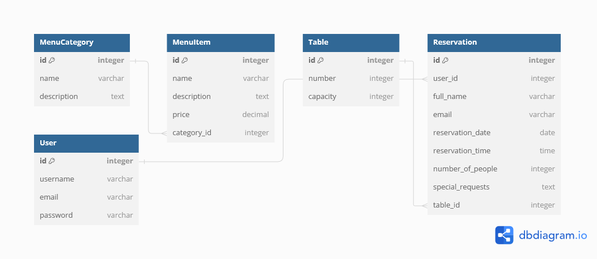

## Fonts

### Font Awesome

Font Awesome is used for a wide range of icons and vector graphics that enhance the visual appeal of the application. It provides a versatile and easy-to-use set of icons that are seamlessly integrated into the design.

- **Font Awesome CSS**: [Font Awesome CDN](https://cdnjs.cloudflare.com/ajax/libs/font-awesome/5.15.3/css/all.min.css)

### Google Fonts

To ensure a clean and modern typography, I use Google Fonts. This provides a selection of high-quality, web-safe fonts that are easy to read and visually appealing.

- **Roboto**: A sans-serif font used for its readability and modern look. 
  - [Roboto Google Font](https://fonts.googleapis.com/css2?family=Roboto:wght@300&display=swap)

- **Lato**: A sans-serif font known for its friendly and open appearance, used in various weights for headings and body text.
  - [Lato Google Font](https://fonts.googleapis.com/css2?family=Lato:wght@300;700&display=swap)

### Wireframes

#### Desktop

Home

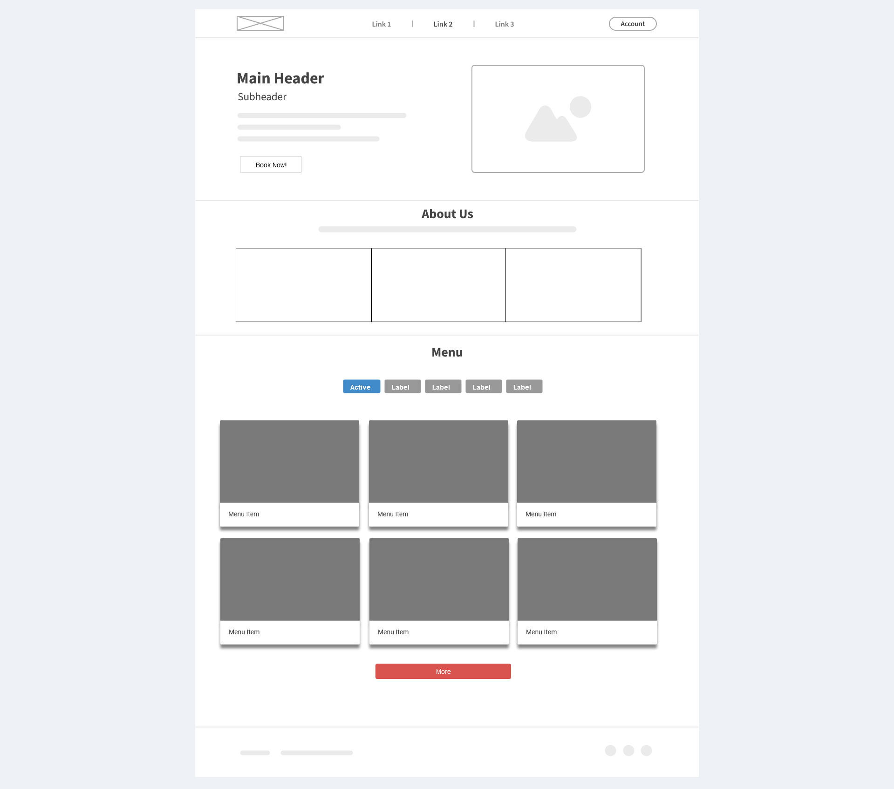

Contact

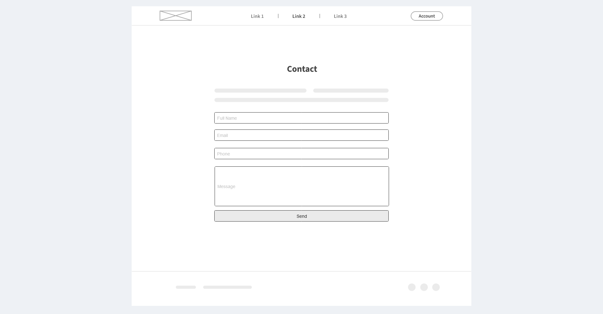

Login

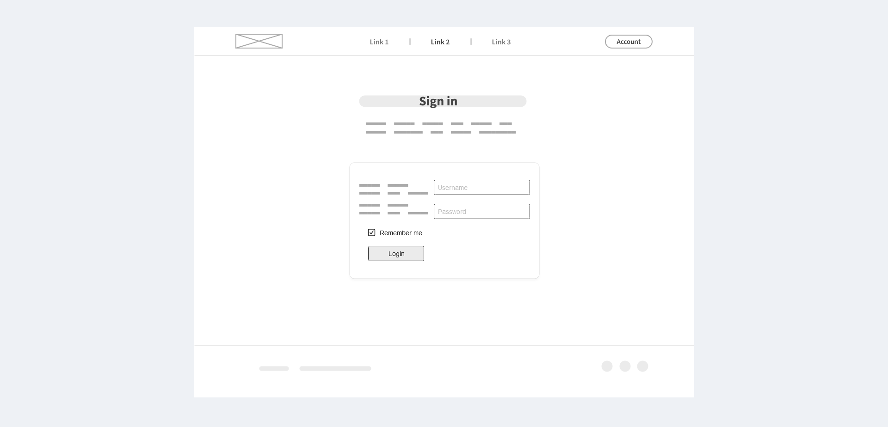

Logout

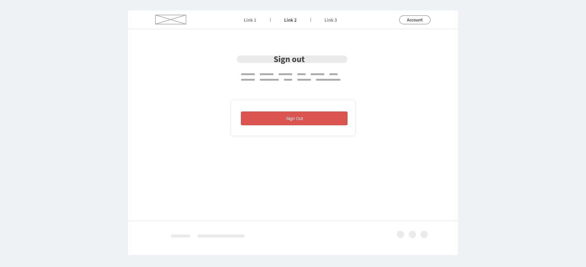

Register

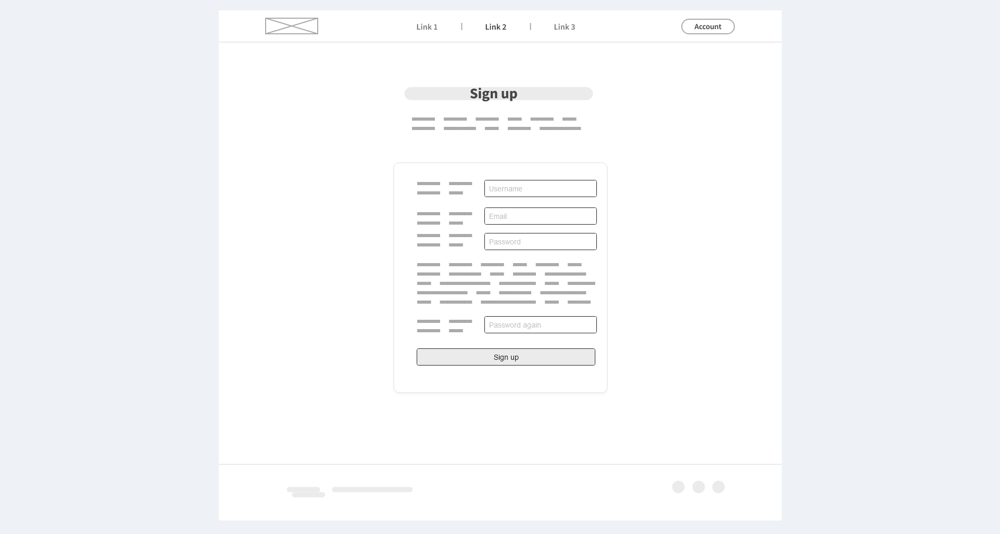

Reserve Table

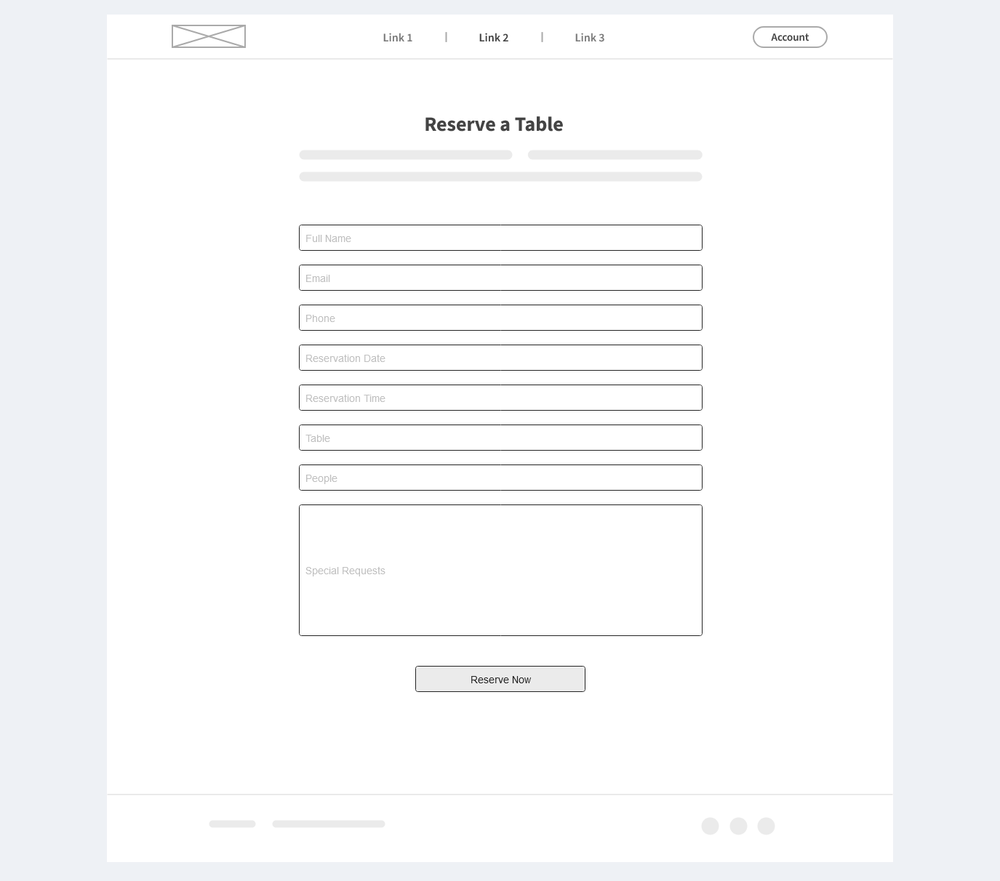

View Reservations

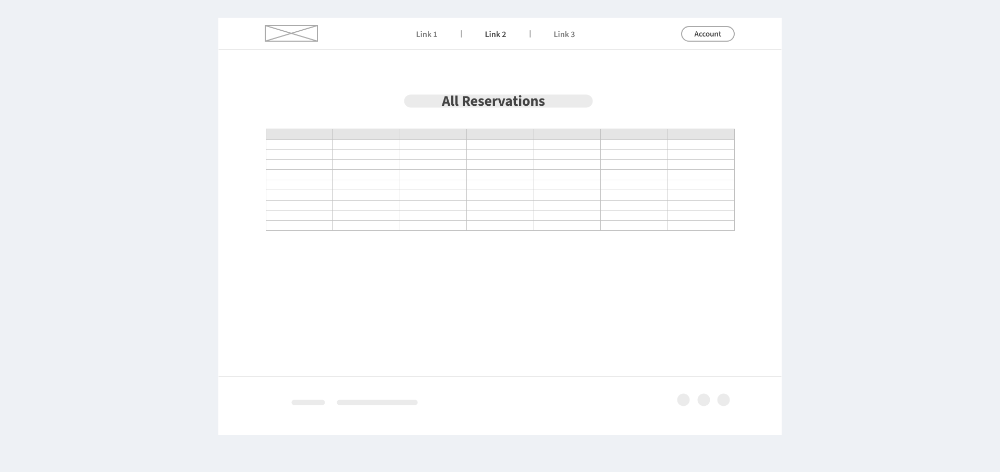

#### Mobile

Home

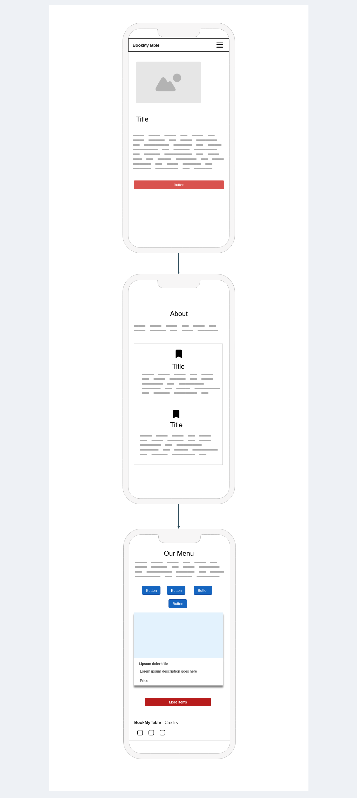

Contact

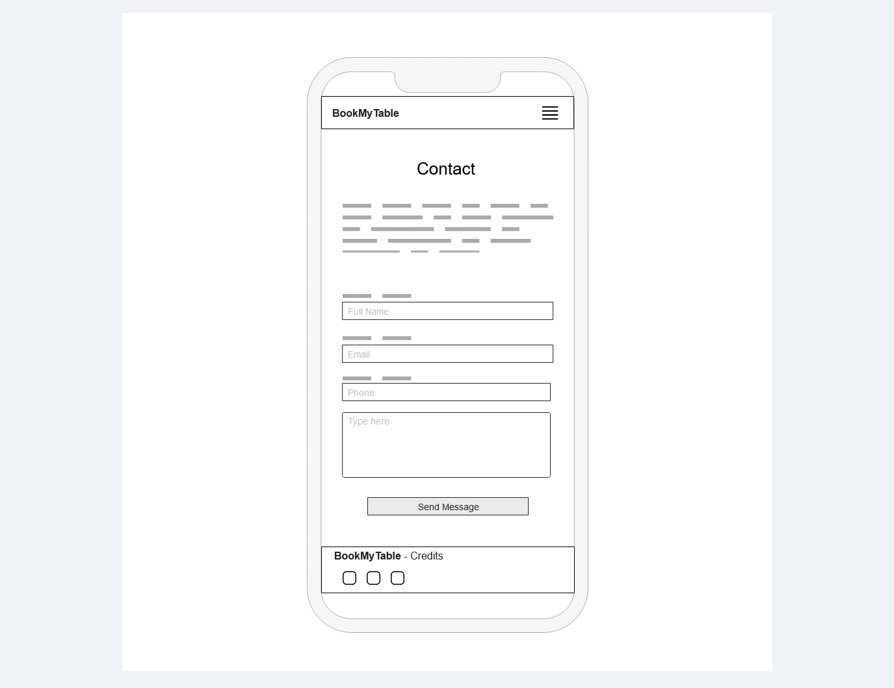

Login

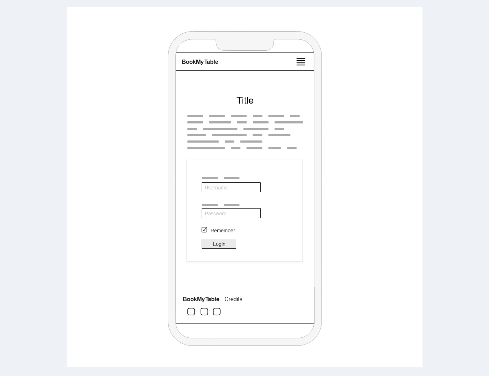

Logout

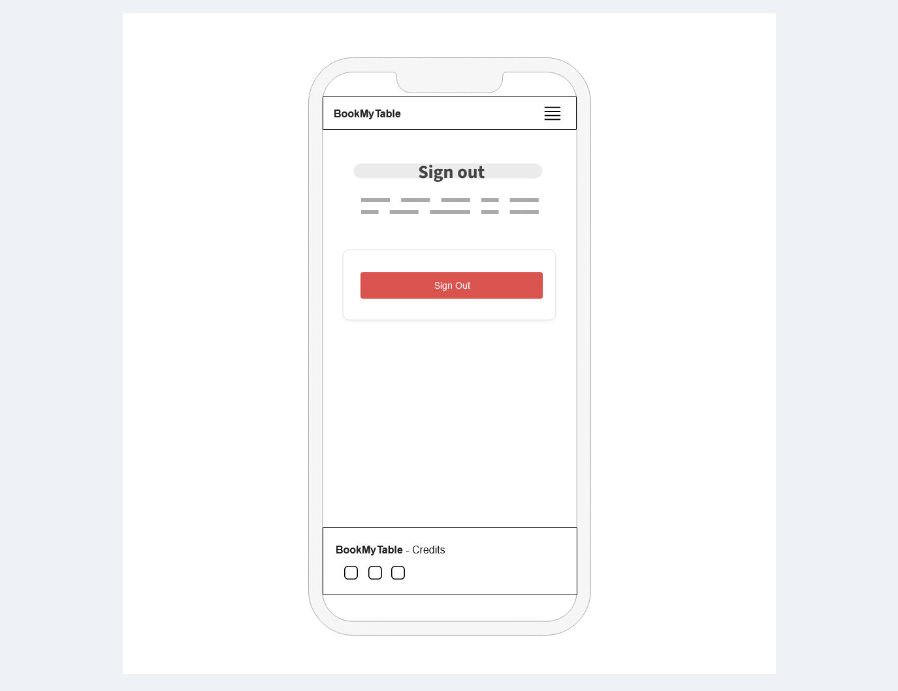

Register

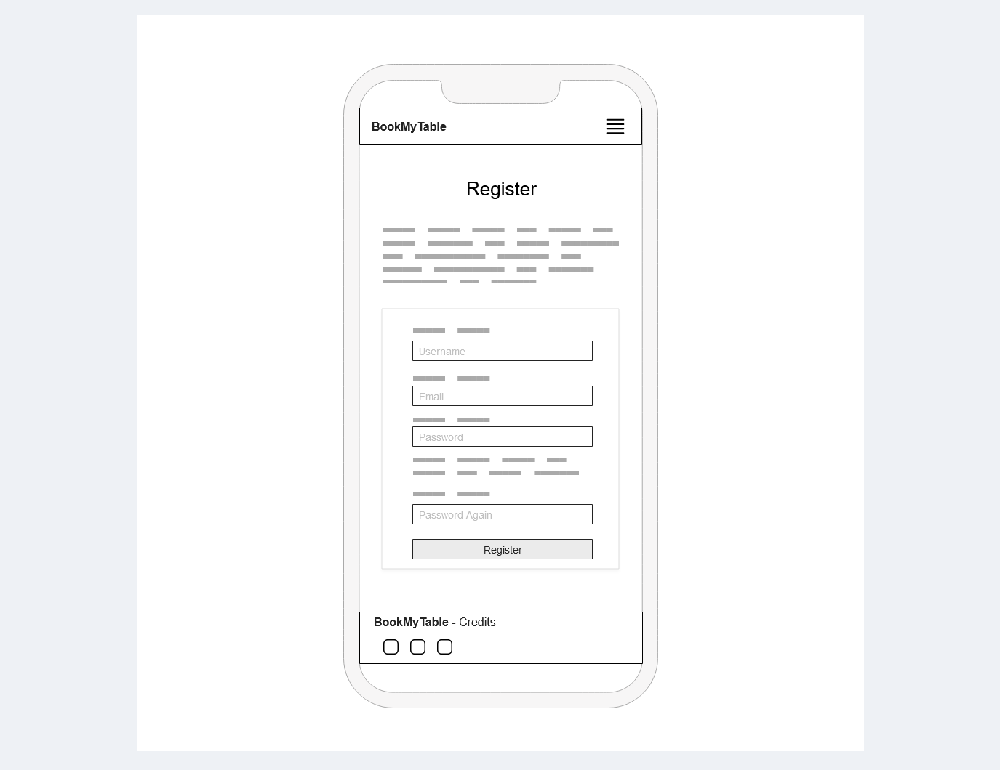

Reserve Table

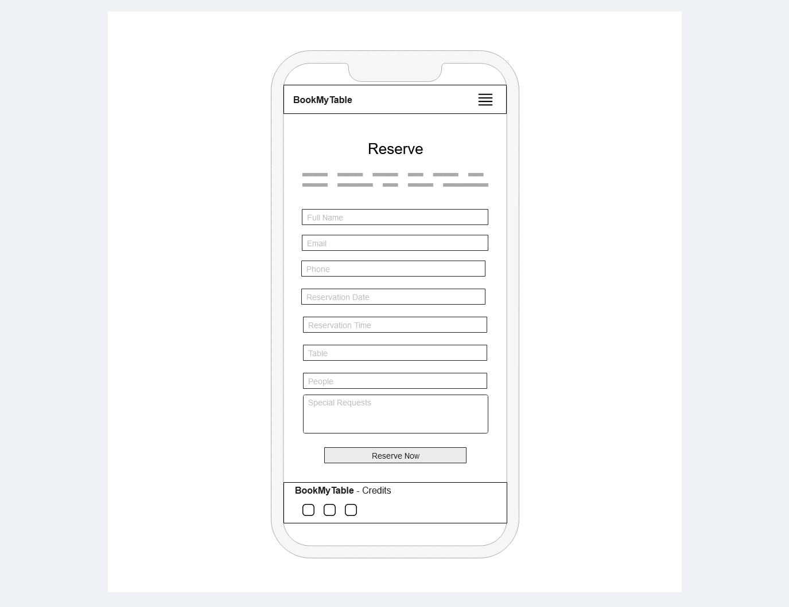

View Reservations

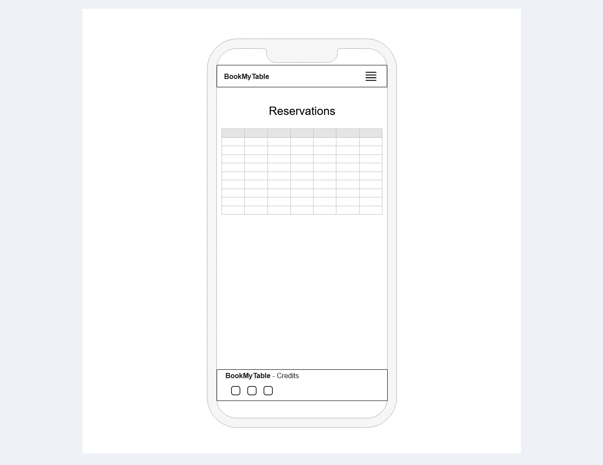

### Agile Methodology

In my project, **BookMyTable**, I use Agile methodology to help manage the development process effectively. Here’s how it works:

1. **Work in Short Cycles (Sprints)**
   - I break the project into small, manageable chunks called sprints, each lasting about two days to one week. At the end of each sprint, I review what has been accomplished and plan the next steps.

2. **Define What to Build (User Stories)**
   - I write user stories to describe what features or improvements are needed. Each story outlines what needs to be done from the user’s perspective, making it clear what the goal is.

3. **Daily Check-ins**
   - I do quick daily updates to keep track of progress, identify any problems, and stay focused on the goals for the current sprint.

4. **Plan the Sprint**
   - At the start of each sprint, I plan which user stories or tasks I will work on. This helps me set clear goals and manage my time effectively.

5. **Review and Get Feedback**
   - At the end of each sprint, I review the work done and gather feedback. This helps me ensure the project is on the right track and meets the desired goals.

6. **Reflect and Improve**
   - After each sprint, I take time to reflect on what went well and what could be improved. This helps me make better decisions and improve my process for the next sprint.

7. **Stay Flexible**
   - I remain open to changes and adapt my plans as needed based on feedback or new insights. This flexibility helps me respond to any changes or challenges that arise.

By using Agile, I manage the project in a way that allows for regular progress checks, continuous improvement, and adjustments based on feedback. This approach helps me stay organized and focused while adapting to new information and ensuring the project evolves effectively.
